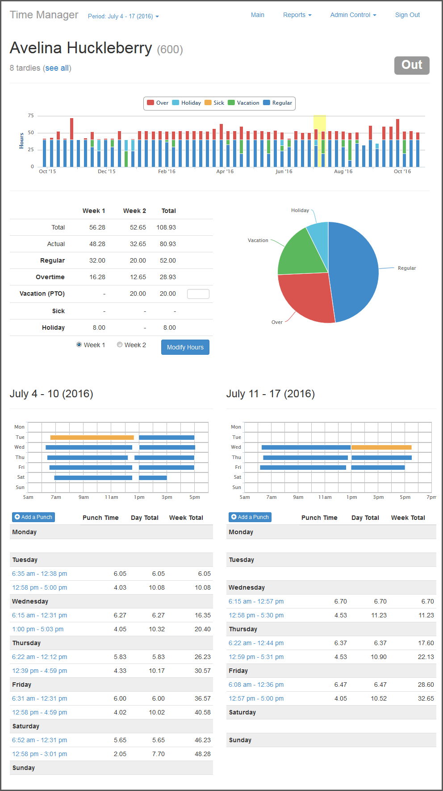
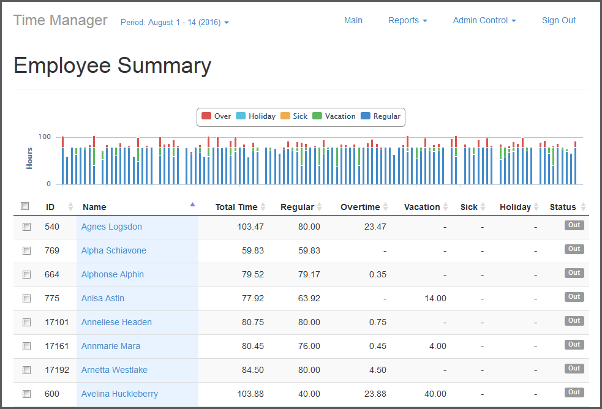

# Time Clock System
There are a couple parts to this system, manager, Android and web clients. Some key features of the system:
* Active Directory authentication for managers and employees
* WiFi terminals (Android tabled) for reading physical badges
* Badges are Maxim iButton's, very durrable
* Automatic flagging of tardies along with tracking
* Various reports for time and changes made
* Easy export / upload to external payroll, iSeries or Zuman.

## Manager
This is for managers and administrators to manage accounts, modify hours and get reports for time. Employee details:

Quick view of all employees:

## Web Client
Employees can see current and past hours while punching in or out.

## Android Terminal
A cheap Android tablet can be used along with a USB iButton reader so employees can punch in / out.
